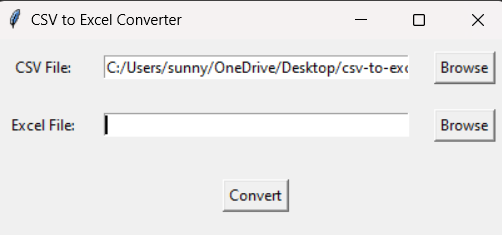

# csv-to-excel-converter

## CSV to Excel Converter Application 📱

Description
A CSV to Excel Converter application is a utility that converts CSV (Comma-Separated Values) files into Excel (XLS/XLSX) format. This tool is essential for users who work with data and need the enhanced functionality and features of Excel, such as formatting, formulas, and visualization. The application simplifies data management and ensures compatibility with Excel-based workflows.

## Key Features 🌟
1. File Conversion
Convert CSV files to Excel formats (XLS/XLSX).
Support for large CSV files without performance degradation.

2. Formatting Options
Auto-detect and format data types (text, numbers, dates).
Preserve delimiters and special characters.
Customizable column widths and cell formatting.

3. Batch Conversion
Convert multiple CSV files to Excel format simultaneously.

4. Error Handling
Detect and notify users of formatting issues or invalid CSV structures.
Log errors and provide suggestions for corrections.

5. Data Preview
Display a preview of the CSV file before conversion.
Allow manual adjustments, such as renaming columns or editing data.

6. Customization
Set delimiter preferences (comma, semicolon, tab).
Enable or disable headers in the output file.
Choose between XLS and XLSX output formats.

7. Performance Optimization
Handle large datasets efficiently without crashing or slowing down.
Provide progress indicators for lengthy conversions.

8. Integration and Export Options
Export converted files directly to cloud services like Google Drive or OneDrive.
Integration with email clients for sharing files post-conversion.

9. Cross-Platform Support
Available on Windows, macOS, Linux, and mobile platforms.

10. Security
Ensure data privacy with local file processing (no internet upload required).
Encrypt sensitive data during conversion (optional).

## How It Works 🎗️💫
File Selection:

Upload or drag-and-drop the CSV file(s) into the application.
Data Preview (Optional):

View a table of the CSV content before conversion.
Edit, reformat, or adjust data if needed.
Set Preferences:

Choose delimiters, output format (XLS/XLSX), and other settings.
Conversion Process:

Click "Convert" to start the conversion.
The application processes the CSV file and generates an Excel file.
Output File:

Download the converted file or save it to a specified location.
Optionally, export it to cloud storage or share via email.
Error Handling:

If the CSV file contains errors (e.g., missing data, invalid formats), the app provides a detailed report for resolution.

## screenshot🤖

